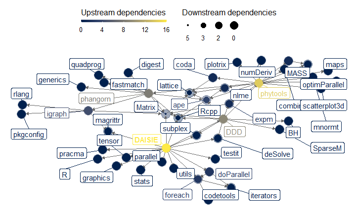
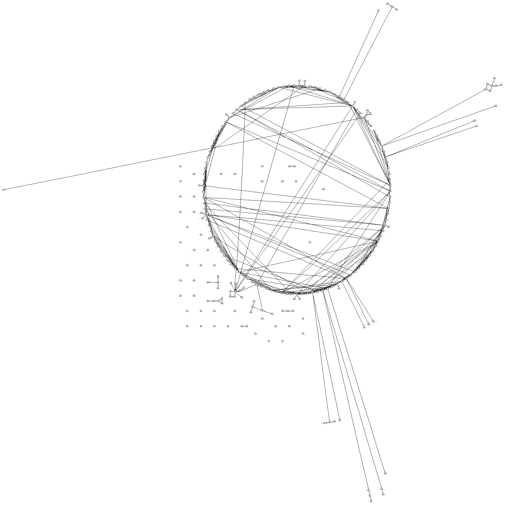

## Index
* Overview / status
  + Inference, simulation, plotting
  + Compiled/foreign code (C++, FORTRAN)
  + Dependencies
* Improvements
  + Interface
  + Maintainability
  + Style
* Feedback

# Overview / status

## DAISIE at a glance


```
## [1] "|source |language     | file_count| file_count_pct|   loc|   loc_pct| blank_lines| blank_line_pct| comment_lines| comment_line_pct|"
## [2] "|:------|:------------|----------:|--------------:|-----:|---------:|-----------:|--------------:|-------------:|----------------:|"
## [3] "|DAISIE |R            |        144|      0.4444444| 19894| 0.4382518|        1354|      0.3516883|          5345|        0.4440844|"
## [4] "|DAISIE |HTML         |          4|      0.0123457|  1500| 0.0330440|         140|      0.0363636|             8|        0.0006647|"
## [5] "|DAISIE |C++          |          2|      0.0061728|   440| 0.0096929|         109|      0.0283117|            29|        0.0024094|"
## [6] "|DAISIE |Fortran 95   |          1|      0.0030864|   271| 0.0059700|          76|      0.0197403|           170|        0.0141243|"
## [7] "|DAISIE |C/C++ Header |          3|      0.0092593|   224| 0.0049346|          62|      0.0161039|            11|        0.0009139|"
```

## Inference

* Accessed primarily (but not exclusively) via the `DAISIE_ML_*()` functions
* 5 (6 if redundant `DAISIE_ML()` is counted) functions, common elements in the function tree
* General use of many arguments, defaults prevalent along function trees
* Very deep call tree

## Inference

```
1. └─DAISIE:::DAISIE_ML1(...)
  2.   └─DDD::optimizer(...) at DAISIE/R/DAISIE_ML1.R:330:2
  3.     ├─base::suppressWarnings(...)
  4.     │ └─base::withCallingHandlers(...)
  5.     ├─subplex::subplex(...)
  6.     │ └─base::tryCatch(...)
  7.     │   └─base (local) tryCatchList(expr, classes, parentenv, handlers)
  8.     │     └─base (local) tryCatchOne(expr, names, parentenv, handlers[[1L]])
  9.     │       └─base (local) doTryCatch(return(expr), name, parentenv, handler)
 10.     └─DDD (local) `<fn>`(...)
 11.       └─DAISIE (local) fun(trparsopt = trparsopt, ...)
 12.         └─DAISIE::DAISIE_loglik_all(...) at DAISIE/R/DAISIE_ML1.R:53:6
 13.           └─DAISIE:::DAISIE_loglik_CS_choice(...) at DAISIE/R/DAISIE_loglik_CS.R:1023:6
 14.             └─DAISIE:::DAISIE_loglik(...) at DAISIE/R/DAISIE_loglik_CS.R:711:4
 15.               └─DAISIE:::DAISIE_integrate(...) at DAISIE/R/DAISIE_loglik_CS.R:650:14
 16.                 └─DAISIE:::DAISIE_integrate_const(...) at DAISIE/R/DAISIE_loglik_CS.R:1196:4
 17.                   └─DAISIE:::DAISIE_ode_cs(...) at DAISIE/R/DAISIE_loglik_CS.R:1241:4
 18.                     └─lobstr::cst() at DAISIE/R/DAISIE_loglik_CS.R:1343:2
```

## Simulation

* Accessed via the `DAISIE_sim_*()` functions
* 7 (8, if redundant `DAISIE_sim()` is counted) functions, common elements in the function tree

## Plotting

* Accessed via the `DAISIE_plot_*()` functions
* 4 functions, one part of function tree of simulation code

## Acessory functions

* `DAISIE_dataprep()`, `DAISIE_probdist()` etc

## Dependencies


```
## rsetienne/DAISIE 4.3.0 [new][bld][cmp][dl] (unknown size)
## ├─deSolve 1.34 [new][dl] (2.49 MB)
## ├─DDD 5.0 [new][dl] (871.68 kB)
## │ ├─deSolve
## │ ├─ape 5.6-2 [new][dl] (3.54 MB)
## │ │ ├─nlme 3.1-160 -> 3.1-162 [upd][bld][cmp][dl] (848.55 kB)
## │ │ │ └─lattice 0.20-45 
## │ │ ├─lattice
## │ │ └─Rcpp 1.0.10 [new][dl] (2.82 MB)
## │ ├─phytools 1.2-0 [new][dl] (2.27 MB)
## │ │ ├─ape
## │ │ ├─maps 3.4.1 [new][dl] (3.10 MB)
## │ │ ├─clusterGeneration 1.3.7 [new][dl] (268.00 kB)
## │ │ │ └─MASS 7.3-58.1 -> 7.3-58.2 [upd][dl] (1.17 MB)
## │ │ ├─coda 0.19-4 [new][dl] (322.21 kB)
## │ │ │ └─lattice
## │ │ ├─combinat 0.0-8 [new][dl] (42.78 kB)
## │ │ ├─expm 0.999-7 [new][dl] (213.63 kB)
## │ │ │ └─Matrix 1.5-1 -> 1.5-3 [upd][dl] (4.57 MB)
## │ │ │   └─lattice
## │ │ ├─MASS
## │ │ ├─mnormt 2.1.1 [new][dl] (179.98 kB)
## │ │ ├─nlme
## │ │ ├─numDeriv 2016.8-1.1 [new][dl] (116.10 kB)
## │ │ ├─optimParallel 1.0-2 [new][dl] (202.97 kB)
## │ │ ├─phangorn 2.11.1 [new][dl] (2.96 MB)
## │ │ │ ├─ape
## │ │ │ ├─digest 0.6.31 [new][dl] (195.05 kB)
## │ │ │ ├─fastmatch 1.1-3 [new][dl] (39.90 kB)
## │ │ │ ├─generics 0.1.3 [new][dl] (80.51 kB)
## │ │ │ ├─igraph 1.3.5 [new][dl] (5.84 MB)
## │ │ │ │ ├─magrittr 2.0.3 [new][dl] (227.23 kB)
## │ │ │ │ ├─Matrix
## │ │ │ │ ├─pkgconfig 2.0.3 [new][dl] (22.55 kB)
## │ │ │ │ └─rlang 1.0.6 [new][dl] (1.57 MB)
## │ │ │ ├─Matrix
## │ │ │ ├─quadprog 1.5-8 [new][dl] (36.70 kB)
## │ │ │ └─Rcpp
## │ │ ├─plotrix 3.8-2 [new][dl] (1.14 MB)
## │ │ └─scatterplot3d 0.3-42 [new][dl] (352.44 kB)
## │ ├─subplex 1.8 [new][dl] (43.13 kB)
## │ ├─Matrix
## │ ├─expm
## │ ├─SparseM 1.81 [new][dl] (1.03 MB)
## │ ├─Rcpp
## │ └─BH 1.81.0-1 [new][dl] (21.36 MB)
## ├─subplex
## ├─Matrix
## ├─tensor 1.5 [new][dl] (16.13 kB)
## ├─pracma 2.4.2 [new][dl] (1.73 MB)
## ├─testit 0.13 [new][dl] (34.34 kB)
## ├─foreach 1.5.2 [new][dl] (148.11 kB)
## │ ├─codetools 0.2-18 -> 0.2-19 [upd][bld][dl] (38.23 kB)
## │ └─iterators 1.0.14 [new][dl] (353.13 kB)
## ├─doParallel 1.0.17 [new][dl] (191.86 kB)
## │ ├─foreach
## │ └─iterators
## ├─magrittr
## ├─Rcpp
## ├─RcppEigen 0.3.3.9.3 [new][dl] (2.28 MB)
## │ ├─Matrix
## │ └─Rcpp
## ├─BH
## ├─covr 3.6.1 [new][dl] (334.55 kB)
## │ ├─digest
## │ ├─jsonlite 1.8.4 [new][dl] (1.10 MB)
## │ ├─rex 1.2.1 [new][dl] (126.62 kB)
## │ │ └─lazyeval 0.2.2 [new][dl] (161.09 kB)
## │ ├─httr 1.4.4 [new][dl] (518.71 kB)
## │ │ ├─curl 5.0.0 [new][dl] (2.62 MB)
## │ │ ├─jsonlite
## │ │ ├─mime 0.12 [new][dl] (40.62 kB)
## │ │ ├─openssl 2.0.5 [new][dl] (2.65 MB)
## │ │ │ └─askpass 1.1 [new][dl] (72.27 kB)
## │ │ │   └─sys 3.4.1 [new][dl] (46.44 kB)
## │ │ └─R6 2.5.1 [new][dl] (84.31 kB)
## │ ├─crayon 1.5.2 [new][dl] (162.81 kB)
## │ ├─withr 2.5.0 [new][dl] (232.17 kB)
## │ └─yaml 2.3.7 [new][dl] (116.47 kB)
## ├─testthat 3.1.6 [new][dl] (2.10 MB)
## │ ├─brio 1.1.3 [new][dl] (38.42 kB)
## │ ├─callr 3.7.3 [new][dl] (440.31 kB)
## │ │ ├─processx 3.8.0 [new][dl] (846.87 kB)
## │ │ │ ├─ps 1.7.2 [new][dl] (549.07 kB)
## │ │ │ └─R6
## │ │ └─R6
## │ ├─cli 3.6.0 [new][dl] (1.30 MB)
## │ ├─desc 1.4.2 [new][dl] (326.92 kB)
## │ │ ├─cli
## │ │ ├─R6
## │ │ └─rprojroot 2.0.3 [new][dl] (109.33 kB)
## │ ├─digest
## │ ├─ellipsis 0.3.2 [new][dl] (40.45 kB)
## │ │ └─rlang
## │ ├─evaluate 0.20 [new][dl] (80.55 kB)
## │ ├─jsonlite
## │ ├─lifecycle 1.0.3 [new][dl] (138.91 kB)
## │ │ ├─cli
## │ │ ├─glue 1.6.2 [new][dl] (162.07 kB)
## │ │ └─rlang
## │ ├─magrittr
## │ ├─pkgload 1.3.2 [new][dl] (176.29 kB)
## │ │ ├─cli
## │ │ ├─crayon
## │ │ ├─desc
## │ │ ├─fs 1.6.1 [new][bld][cmp][dl] (1.19 MB)
## │ │ ├─glue
## │ │ ├─rlang
## │ │ ├─rprojroot
## │ │ └─withr
## │ ├─praise 1.0.0 [new][dl] (19.81 kB)
## │ ├─processx
## │ ├─ps
## │ ├─R6
## │ ├─rlang
## │ ├─waldo 0.4.0 [new][dl] (101.97 kB)
## │ │ ├─cli
## │ │ ├─diffobj 0.3.5 [new][dl] (990.51 kB)
## │ │ │ └─crayon
## │ │ ├─fansi 1.0.4 [new][dl] (313.27 kB)
## │ │ ├─glue
## │ │ ├─rematch2 2.1.2 [new][dl] (47.50 kB)
## │ │ │ └─tibble 3.1.8 [new][dl] (733.27 kB)
## │ │ │   ├─fansi
## │ │ │   ├─lifecycle
## │ │ │   ├─magrittr
## │ │ │   ├─pillar 1.8.1 [new][dl] (689.78 kB)
## │ │ │   │ ├─cli
## │ │ │   │ ├─fansi
## │ │ │   │ ├─glue
## │ │ │   │ ├─lifecycle
## │ │ │   │ ├─rlang
## │ │ │   │ ├─utf8 1.2.3 [new][bld][cmp][dl] (241.41 kB)
## │ │ │   │ └─vctrs 0.5.2 [new][dl] (1.38 MB)
## │ │ │   │   ├─cli
## │ │ │   │   ├─glue
## │ │ │   │   ├─lifecycle
## │ │ │   │   └─rlang
## │ │ │   ├─pkgconfig
## │ │ │   ├─rlang
## │ │ │   └─vctrs
## │ │ ├─rlang
## │ │ └─tibble
## │ └─withr
## ├─knitr 1.42 [new][dl] (1.50 MB)
## │ ├─evaluate
## │ ├─highr 0.10 [new][dl] (46.53 kB)
## │ │ └─xfun 0.37 [new][bld][cmp][dl] (130.06 kB)
## │ ├─yaml
## │ └─xfun
## ├─rmarkdown 2.20 [new][dl] (3.72 MB)
## │ ├─bslib 0.4.2 [new][dl] (5.06 MB)
## │ │ ├─htmltools 0.5.4 [new][dl] (350.99 kB)
## │ │ │ ├─digest
## │ │ │ ├─base64enc 0.1-3 [new][dl] (32.48 kB)
## │ │ │ ├─rlang
## │ │ │ ├─fastmap 1.1.0 [new][dl] (126.56 kB)
## │ │ │ └─ellipsis
## │ │ ├─jsonlite
## │ │ ├─sass 0.4.5 [new][dl] (2.57 MB)
## │ │ │ ├─fs
## │ │ │ ├─rlang
## │ │ │ ├─htmltools
## │ │ │ ├─R6
## │ │ │ └─rappdirs 0.3.3 [new][dl] (51.28 kB)
## │ │ ├─jquerylib 0.1.4 [new][dl] (525.96 kB)
## │ │ │ └─htmltools
## │ │ ├─rlang
## │ │ ├─cachem 1.0.6 [new][dl] (71.19 kB)
## │ │ │ ├─rlang
## │ │ │ └─fastmap
## │ │ ├─memoise 2.0.1 [new][dl] (50.30 kB)
## │ │ │ ├─rlang
## │ │ │ └─cachem
## │ │ ├─base64enc
## │ │ └─mime
## │ ├─evaluate
## │ ├─htmltools
## │ ├─jquerylib
## │ ├─jsonlite
## │ ├─knitr
## │ ├─stringr 1.5.0 [new][dl] (318.25 kB)
## │ │ ├─cli
## │ │ ├─glue
## │ │ ├─lifecycle
## │ │ ├─magrittr
## │ │ ├─rlang
## │ │ ├─stringi 1.7.12 [new][dl] (14.22 MB)
## │ │ └─vctrs
## │ ├─tinytex 0.44 [new][bld][dl] (32.98 kB)
## │ │ └─xfun
## │ ├─xfun
## │ └─yaml
## ├─gridExtra 2.3 [new][dl] (1.11 MB)
## │ └─gtable 0.3.1 [new][dl] (164.27 kB)
## ├─dplyr 1.1.0 [new][dl] (1.55 MB)
## │ ├─cli
## │ ├─generics
## │ ├─glue
## │ ├─lifecycle
## │ ├─magrittr
## │ ├─pillar
## │ ├─R6
## │ ├─rlang
## │ ├─tibble
## │ ├─tidyselect 1.2.0 [new][dl] (223.97 kB)
## │ │ ├─cli
## │ │ ├─glue
## │ │ ├─lifecycle
## │ │ ├─rlang
## │ │ ├─vctrs
## │ │ └─withr
## │ └─vctrs
## ├─ggplot2 3.4.0 [new][dl] (4.21 MB)
## │ ├─cli
## │ ├─glue
## │ ├─gtable
## │ ├─isoband 0.2.7 [new][dl] (1.96 MB)
## │ ├─lifecycle
## │ ├─MASS
## │ ├─mgcv 1.8-41 
## │ │ ├─nlme
## │ │ └─Matrix
## │ ├─rlang
## │ ├─scales 1.2.1 [new][dl] (615.68 kB)
## │ │ ├─farver 2.1.1 [new][dl] (1.51 MB)
## │ │ ├─labeling 0.4.2 [new][dl] (62.51 kB)
## │ │ ├─lifecycle
## │ │ ├─munsell 0.5.0 [new][dl] (244.69 kB)
## │ │ │ └─colorspace 2.1-0 [new][dl] (2.62 MB)
## │ │ ├─R6
## │ │ ├─RColorBrewer 1.1-3 [new][dl] (55.84 kB)
## │ │ ├─rlang
## │ │ └─viridisLite 0.4.1 [new][dl] (1.30 MB)
## │ ├─tibble
## │ ├─vctrs
## │ └─withr
## ├─ggtree 3.6.2 [new][dl] (unknown size)
## │ ├─ape
## │ ├─aplot 0.1.9 [new][dl] (60.19 kB)
## │ │ ├─ggfun 0.0.9 [new][dl] (263.12 kB)
## │ │ │ ├─ggplot2
## │ │ │ └─rlang
## │ │ ├─ggplot2
## │ │ ├─ggplotify 0.1.0 [new][dl] (140.34 kB)
## │ │ │ ├─ggplot2
## │ │ │ ├─gridGraphics 0.5-1 [new][dl] (270.96 kB)
## │ │ │ └─yulab.utils 0.0.6 [new][dl] (40.92 kB)
## │ │ ├─patchwork 1.1.2 [new][dl] (3.24 MB)
## │ │ │ ├─ggplot2
## │ │ │ └─gtable
## │ │ └─magrittr
## │ ├─dplyr
## │ ├─ggplot2
## │ ├─magrittr
## │ ├─purrr 1.0.1 [new][dl] (499.37 kB)
## │ │ ├─cli
## │ │ ├─lifecycle
## │ │ ├─magrittr
## │ │ ├─rlang
## │ │ └─vctrs
## │ ├─rlang
## │ ├─ggfun
## │ ├─yulab.utils
## │ ├─tidyr 1.3.0 [new][dl] (1.29 MB)
## │ │ ├─cli
## │ │ ├─dplyr
## │ │ ├─glue
## │ │ ├─lifecycle
## │ │ ├─magrittr
## │ │ ├─purrr
## │ │ ├─rlang
## │ │ ├─stringr
## │ │ ├─tibble
## │ │ ├─tidyselect
## │ │ └─vctrs
## │ ├─tidytree 0.4.2 [new][dl] (244.87 kB)
## │ │ ├─ape
## │ │ ├─dplyr
## │ │ ├─lazyeval
## │ │ ├─magrittr
## │ │ ├─rlang
## │ │ ├─tibble
## │ │ ├─tidyr
## │ │ ├─tidyselect
## │ │ ├─yulab.utils
## │ │ ├─pillar
## │ │ └─cli
## │ ├─treeio 1.22.0 [new][dl] (unknown size)
## │ │ ├─ape
## │ │ ├─dplyr
## │ │ ├─jsonlite
## │ │ ├─magrittr
## │ │ ├─rlang
## │ │ ├─tibble
## │ │ └─tidytree
## │ ├─scales
## │ └─cli
## ├─tidytree
## ├─tidyr
## ├─purrr
## ├─ape
## ├─phytools
## └─tibble
## 
## Key:  [new] new | [upd] update | [dl] download | [bld] build | [cmp] compile
```

## Dependencies

<!-- -->

## Dependencies


| generation|  n|
|----------:|--:|
|         -5| 15|
|         -4| 19|
|         -3| 27|
|         -2| 20|
|         -1| 17|
|          0|  1|

## Dependencies

* High number of dependencies
* Some package dependencies themselves have a high number of upstream dependencies
* To maintain the package on CRAN, all dependencies on Imports, Depends and Suggests must be equally available
* Critical dependencies include Rcpp, deSolve, DDD (for ML optimization, long term free-standing package?)
* The lower the number of dependencies, higher reliability

## Compiled/foreign code (C++, FORTRAN)

* Numerical integration of ODE system implemented via R, C++ (using BOOST libraries) and FORTRAN code
* Redundant methods are helpful to compare with each other and as fallbacks when one fails
* Increase maintenance cost. Arguably breaks DRY rule.

# Improvements

## Interface
```
DAISIE_sim_cr(
  time,
  M,
  pars,
  replicates,
  divdepmodel = "CS",
  nonoceanic_pars = c(0, 0),
  num_guilds = NULL,
  prop_type2_pool = NA,
  replicates_apply_type2 = TRUE,
  sample_freq = 25,
  plot_sims = TRUE,
  hyper_pars = create_hyper_pars(d = 0, x = 0),
  area_pars = create_area_pars(max_area = 1, current_area = 1, proportional_peak_t = 0,
    total_island_age = 0, sea_level_amplitude = 0, sea_level_frequency = 0,
    island_gradient_angle = 0),
  cond = 0,
  verbose = TRUE,
  ...
)
```

## Interface

* Standardize argument names: choose and rigidly enforce style guide
* Complex arguments should always be named (lists) at the interface level, and as much as possible in inner functions
* Helper functions for complex arguments are an option (e.g., `create_hyper_pars()`)
  + More space for long form documentation, defaults and ease of testing
* Don't export many currently exported functions

## Maintainability

* Defaults *only* present in user interface
* Deprecate R and FORTAN implementations to a separate package
  + Allows code be kept for tests
  + Same maintenance cost
* Remove dependencies. Consider removing most if not all plotting functions
* Rename ambiguously named functions (i.e., `DAISIE_ML1()`, `DAISIE_ML2()`, etc.)
* Trim down repeated (nearly) identical portions of code (e.g. `DAISIE_ML_*()` functions until `DAISIE_loglik()`)

## Maintainabilty

<!-- -->

## Feedback

* Thanks for listening! Any comments?
